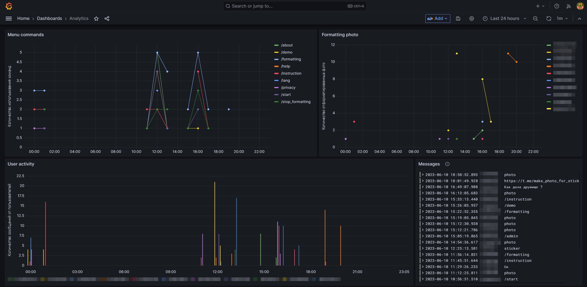

> README на русском языке доступен [здесь](README.ru.md)

[](https://github.com/PetruninKV/telebot_make_foto_for_sticker/actions/workflows/checks.yml)

## IziPiziStickers [](https://t.me/make_photo_for_sticker_bot)

[IziPiziStickers](https://t.me/make_photo_for_sticker_bot) - helps you create your own Telegram stickers.

## Main Purpose
Users can create their own stickers without using any additional software - without leaving Telegram.

The bot receives images or files from users and converts them into .png format without a background, with a resolution not exceeding 512x512px, which is the required requirement for creating stickers. All you have to do is forward the received file to [@Stickers](https://t.me/Stickers).

Detailed project development timeline and description of all the capabilities of the bot can be found [here](description.md).

## Used technology
- Python 3.10: programming language
- Aiogram 3.x: framework for creating Telegram bots
- Redis: a database system that works with key-value data structures
- InfluxDB 2.7: a time series database
- Grafana: data visualization
- Docker and docker-compose: containerization of all components
- Git Actions: automated system for building, testing, and deploying code
  and others.

# How to launch

## Preparatory steps
1. Clone the repository
    ```bash
   git clone https://github.com/PetruninKV/IziPiziStickers_bot.git
    ```
2. Go to the created directory and create three subdirectories inside
    ```bash
   mkdir influxdb_data grafana_data redis_data
    ```

## Environment Variables
1. Rename .env.example to .env
2. Fill in .env:
   - Get your Telegram token from [@BotFather](https://t.me/BotFather)
   - Specify the administrator's ID for accessing administrator commands
   - We'll add the InfluxDB token a little later
   - Run ```id -u``` and specify the obtained value for UID

## Docker
1. The first time, only run the InfluxDB container to create a user and get the token
    ```bash
   docker-compose up influxdb
    ```
2. Open http://localhost:8086 in your browser
   - Get started
   - Fill in Username and Password as you like, and Org Name as 'stats-bot' and Bucket Name as 'events'
   - Choose Quick start, go to Load Data - API Tokens
   - Create a new token - Generate API Token (Custom API Token)
   - Provide a description, add events from Buckets by selecting read-write. Click Generate.
   - Copy the generated token and paste it in .env as INFLUXDB_TOKEN=
3. Start the remaining services
    ```bash
   docker-compose up
    ```
4. Open http://localhost:3000 in your browser
   - admin admin - default login and password. Change them on the next step or skip these settings
   - Go to the home page and select "Add your first data source"
   - Choose InfluxDB from the list
     - In Query Language, select Flux
     - HTTP URL - http://influxdb:8086
     - Disable all options in Auth
     - In InfluxDB Details:
       - Organization - 'stats-bot'
       - Token - specify the token you obtained earlier in step 2
       - Default Bucket - 'events'
     - Click Save & test
     - You should see "Datasource updated" and "Datasource is working. 1 buckets found" - which means everything is good.
     - In the browser's address bar, copy the database identifier, e.g., localhost:3000/datasources/edit/<b>D4p5Afw4k</b>. You'll have your own identifier.
     - Run the following command:
        ```bash
        ./scripts/change_id.sh
        ```
        This script renames the configuration file (dashboard.example.json) to dashboard.json and replaces all occurrences of `<b>"uid": "YOUR_ID"</b>` with your obtained identifier from the previous step.

        If the script doesn't have execute permissions, you can use:
        ```bash
        chmod +x ./scripts/change_id.sh
        ```

     - Go to the [dashboard settings](http://localhost:3000/dashboard/import) and import dashboard.json.
     - You should now have access to the statistics.


"Menu commands": This graph displays the usage of commands within a specific time interval. It shows the number of times menu commands were used during the given time period.
"Formatting photo": This graph shows the number of photos formatted by the user within a specific time interval. It allows tracking user activity related to photo formatting.
"User activity": This graph displays the total number of messages sent by a user within a specific time interval. It demonstrates user activity based on the quantity of messages they have sent.
"Messages": This table displays messages that were not recognized as commands, including information about photos sent by users when they were not in editing mode, and plain text messages. This table allows evaluating user spam, incorrect usage of the editing mode, and commands that were not processed by the bot.
